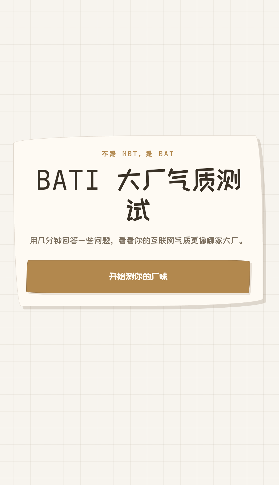

# BATI — 大厂梗文化混搭人设测试

> 不是 MBT，是 BAT

用几分钟回答 12 道趣味问题，测测你的互联网气质是哪种大厂梗混搭人设。

**在线体验：[https://alleschen.com/bati](https://alleschen.com/bati)**

## 截图预览

| 首页 | 人设图鉴 |
|:---:|:---:|
|  |  |

## 玩法

1. 点击「开始测你的厂味」进入答题
2. 12 道四选一问题，滑动选择即可，支持上一题返回
3. 答完后获得你的专属大厂梗混搭人设

## 17 种梗人设

每个结果都是两家或多家大厂文化梗元素的混搭：

| 人设 | 梗来源 |
|------|--------|
| 爱喝开水的企鹅 | 开水团（美团）× 企鹅（腾讯） |
| 没有心跳的蚂蚁 | 没有心「跳」（字节跳动）× 蚂蚁（蚂蚁金服） |
| 爱玩微信的修狗 | 微信（腾讯）× 修狗（京东） |
| 手捧菊花的舞者 | 菊花（华为）× 舞者（字节跳动） |
| 跑滴滴的外卖员 | 滴滴 × 外卖员（美团） |
| 多砍几刀的铁子 | 砍一刀（拼多多）× 铁子（快手） |
| 开动物园的厂长 | 猪（网易）× 熊（百度）× 鹅（腾讯） |
| 熬夜抽卡的二次元鼻祖 | 抽卡（网易）× 二次元（B站） |
| 福报小狗 | 福报（阿里）× 小狗（京东） |
| 爱玩游戏的阿里人 | 游戏（腾讯）× 阿里人（阿里） |
| 你的眼里看到的全是星星 | 100% 浓度 → 宇宙厂（字节） |
| 开心的酒鬼 | 开心（腾讯）× 干杯（bilibili） |
| **天选打工人** ⭐ | SSR 稀有 · 适合任何互联网大厂 |
| **魔术师** ⭐ | SSR 稀有 · 最佛系，适合外企 |
| 99.99% 浓度的阿里人 | 答题高度偏向阿里气质时触发 |
| 99.99% 浓度的字节人 | 答题高度偏向字节气质时触发 |
| 99.99% 浓度的鹅 | 答题高度偏向腾讯气质时触发 |


> SSR 人设基础触发概率仅 1%，浓度人设需要答题路径高度一致才能解锁。

---

# 开发者指南

## 技术栈

- **框架**：React 19 + TypeScript
- **构建**：Vite 8
- **样式**：Tailwind CSS 4
- **路由**：React Router 7
- **测试**：Vitest + Testing Library
- **部署**：静态站点，阿里云 ECS

## 项目结构

```
src/
├── data/
│   ├── personas/         # 17 种人设配置（文案、权重、关键词）
│   └── questions/        # 12 道题目及选项权重
├── domain/
│   ├── persona/          # 人设类型定义
│   ├── questions/        # 题目类型定义
│   └── scoring/          # 算分引擎（权重聚合、SSR、浓度检测、结果决策）
├── features/
│   ├── companies/        # 人设图鉴页
│   └── result/           # 结果页（ViewModel、文案守卫、展示组件）
├── styles/               # 全局样式与设计 token
└── App.tsx               # 主入口（首页、答题、结果路由）
```

## 快速开始

```bash
# 安装依赖
pnpm install

# 本地开发
pnpm dev

# 运行测试
pnpm test

# 构建生产版本
pnpm build
```

## 核心模块

### 算分引擎

答题完成后经过四步决策链：

1. **权重聚合** (`scorePersonaQuiz`) — 累加用户选项对每个人设的权重
2. **SSR 掷骰** (`rollSSR`) — 1% 基础概率 + 答题组合加成
3. **浓度检测** (`detectConcentration`) — 检查是否有单一公司族群权重远超其他
4. **结果决策** (`resolvePersonaResult`) — SSR > 浓度 > 普通 Top1

### 题库设计

- 12 道题 × 4 个选项，每选项映射 3-5 个人设权重（1/2/3 三档分值）
- 基于 8 个隐性维度（社交驱动力、决策风格、新鲜感追求等）交叉验证
- 每个普通人设在题库中至少出现 8 次，保证可达性和区分度

### 视觉风格

深色背景 + 金色/琥珀色强调 + 手绘摇摆边框，所有组件共享统一设计 token。SSR 结果为暗金色主题，浓度结果带动态进度条和公司配色偏移。

## 部署

```bash
# 部署到阿里云
pnpm deploy:aliyun
```

生产构建的 `base` 路径默认为 `/bati/`，可通过 `VITE_APP_BASE` 环境变量覆盖。

## License

MIT
